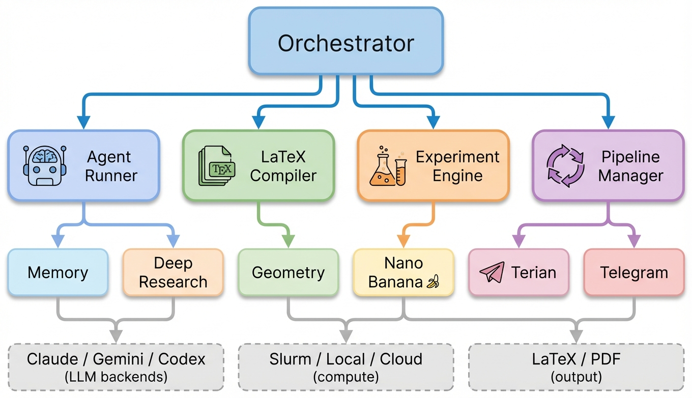

# Architecture

ARK uses a **mixin-based** architecture. The `Orchestrator` class inherits from four mixins, each responsible for a distinct concern:

<p align="center">
  
</p>

## Module Reference

| Module | Lines | Role |
|--------|-------|------|
| `orchestrator.py` | ~1300 | Core class — config loading, hooks, state I/O, project init |
| `agents.py` | ~610 | **AgentMixin** — runs Claude/Gemini/Codex subprocesses, output parsing, rate limit handling, blocking-command watchdog |
| `compiler.py` | ~440 | **CompilerMixin** — pdflatex + bibtex compilation, PDF-to-PNG via PyMuPDF, figure pipeline |
| `execution.py` | ~960 | **ExecutionMixin** — planner cycle, experiment loop, writing phase, meta-debugger, self-repair |
| `pipeline.py` | ~950 | **PipelineMixin** — top-level run loop, 4-step paper iteration, cost tracking |
| `development.py` | ~730 | **DevMixin** — development mode (plan → code → test → review), test runner |
| `memory.py` | ~710 | Score history, stagnation detection, goal anchor, issue-repeat tracking, meta-reflection |
| `compute.py` | ~720 | Compute backend ABC + Slurm, Local, AWS, GCP, Azure, Custom backends |
| `cli.py` | ~3030 | CLI entrypoint — 13 commands, 9-step interactive wizard |
| `telegram.py` | ~720 | Telegram dispatcher — credential lookup, multi-project routing, mailbox |
| `telegram_daemon.py` | ~800 | Persistent Telegram polling daemon — survives `ark stop` |
| `deep_research.py` | ~280 | Deep Research integration |
| `nano_banana.py` | ~180 | AI figure generation via Gemini image models |
| `latex_geometry.py` | ~180 | Venue presets + matplotlib rcParams |
| `ui.py` | ~310 | Terminal UI — ANSI colors, spinners, sparklines, score trends |

## Project Structure

```
ARK/
├── ark/
│   ├── orchestrator.py      # Core class + init + state I/O
│   ├── agents.py            # AgentMixin — agent execution, rate limits
│   ├── compiler.py          # CompilerMixin — LaTeX, PDF, figures
│   ├── execution.py         # ExecutionMixin — planning, experiments, writing
│   ├── pipeline.py          # PipelineMixin — run loop, cost tracking
│   ├── development.py       # DevMixin — dev mode (code + test loop)
│   ├── memory.py            # Score tracking, stagnation, issue memory
│   ├── compute.py           # Compute backends (Slurm, Local, Cloud)
│   ├── cli.py               # CLI entrypoint (ark command)
│   ├── telegram.py          # Telegram dispatcher
│   ├── telegram_daemon.py   # Persistent Telegram daemon
│   ├── deep_research.py     # Deep Research
│   ├── nano_banana.py       # AI figure generation (Gemini)
│   ├── latex_geometry.py    # Venue presets for figure sizing
│   └── ui.py                # Terminal UI helpers
├── projects/
│   └── <name>/
│       ├── config.yaml
│       ├── hooks.py          # Custom research/figure hooks
│       └── agents/*.prompt
├── tests/
├── docs/
├── pyproject.toml
└── LICENSE
```

## State Files

Each project creates runtime state in `<code_dir>/auto_research/`:

```
auto_research/
├── state/
│   ├── paper_state.yaml      # Current iteration, phase, score
│   ├── action_plan.yaml      # Planner output for current iteration
│   ├── latest_review.md      # Most recent reviewer feedback
│   ├── memory.yaml           # Score history, issue tracking
│   ├── checkpoint.yaml       # Phase-level checkpoint for crash recovery
│   ├── findings.yaml         # Accumulated research findings
│   ├── cost_report.yaml      # Per-iteration and cumulative costs
│   └── deep_research.md      # Deep Research report
└── logs/
    └── orchestrator.log
```
